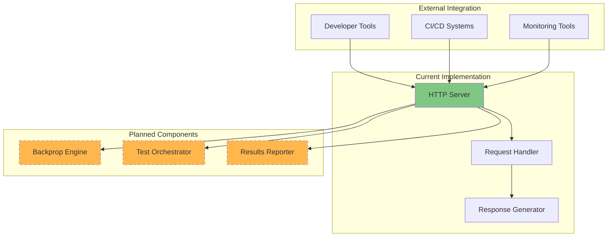

# hao-backprop-test

[](https://nodejs.org/)
[](https://opensource.org/licenses/MIT)
[](https://nodejs.org/)

A specialized testing framework designed to validate and integrate backpropagation algorithms within web-based service architectures. Currently implemented as a foundational HTTP server scaffold, this project serves as a controlled environment for testing backpropagation integration capabilities in distributed systems.

## Overview

The `hao-backprop-test` project addresses the critical need for reliable testing and validation of backpropagation algorithm integration in production web services. The current release represents the foundational HTTP server layer that will support comprehensive machine learning algorithm testing capabilities.

### Current Implementation Status

- ✅ **HTTP Server Foundation**: Basic server infrastructure ready
- 🔄 **Backpropagation Engine**: Planned for future implementation  
- 🔄 **Test Orchestrator**: Planned for future implementation
- 🔄 **Results Reporter**: Planned for future implementation

### Architecture Overview



## Features

### Current Features
- **Lightweight HTTP Server**: Zero-dependency Node.js implementation
- **Cross-Platform Compatibility**: Runs on Windows, macOS, and Linux
- **Localhost Development**: Secure development environment isolation
- **Instant Startup**: Sub-second server initialization
- **Standard HTTP Protocol**: Compatible with all standard HTTP clients

### Planned Features
- **Backpropagation Algorithm Integration**: Validate ML algorithm implementations
- **Test Case Management**: Orchestrate complex testing scenarios
- **Performance Metrics**: Real-time algorithm performance monitoring
- **Results Analytics**: Comprehensive test result reporting and analysis

## Prerequisites

### System Requirements

| Component | Requirement | Version | Installation Guide |
|-----------|-------------|---------|-------------------|
| **Node.js Runtime** | Node.js LTS | 20.x or higher | [Download from nodejs.org](https://nodejs.org/) |
| **Package Manager** | npm | Included with Node.js | Automatically installed with Node.js |
| **Memory** | System RAM | 50MB minimum | Check with `free -h` (Linux/macOS) or Task Manager (Windows) |
| **Network** | Available Port | Port 3000 | Ensure not in use: `netstat -an | grep 3000` |

### Verification Commands

Before proceeding with installation, verify your environment meets the requirements:

```bash
# Check Node.js version (should be 20.x or higher)
node --version
# Example output: v20.10.0

# Check npm version
npm --version  
# Example output: 10.2.3

# Verify port 3000 is available (should return no results)
netstat -an | grep 3000
# No output means port is available

# Check available memory (Linux/macOS)
free -h
# Ensure at least 50MB available
```

## Installation

Follow these step-by-step instructions to set up the development environment:

### Step 1: Clone the Repository

```bash
# Clone the project repository to your local machine
git clone <repository-url> hao-backprop-test

# Navigate to the project directory
cd hao-backprop-test
```

### Step 2: Verify Project Structure

```bash
# List project files to confirm successful clone
ls -la
# Expected output:
# server.js       - Main HTTP server implementation
# package.json    - Project metadata and dependencies
# README.md       - This documentation file
```

### Step 3: Validate Environment

```bash
# Confirm Node.js version compatibility
node --version
# Must be v20.0.0 or higher for optimal compatibility

# Verify the main server file exists and is readable
cat server.js
# Should display the HTTP server implementation
```

### Step 4: No Build Process Required

This project uses a **no-build architecture** - the source code executes directly without compilation or bundling:

- ✅ **No npm install needed** - Zero external dependencies
- ✅ **No build tools required** - Direct source execution
- ✅ **No configuration files** - Runs with default settings
- ✅ **No asset compilation** - Static content served directly

## Usage

### Starting the Server

Launch the HTTP server with a single command:

```bash
# Start the HTTP server
node server.js
# Expected output: Server running at http://127.0.0.1:3000/
```

**Code Explanation:**
- `node server.js` - Executes the JavaScript file using the Node.js runtime
- Server initializes on localhost (127.0.0.1) for security
- Port 3000 is bound for HTTP traffic
- Startup confirmation message indicates successful initialization

### Accessing the Service

Once the server is running, access it through any HTTP client:

#### Web Browser Access
```bash
# Open in your default web browser
open http://127.0.0.1:3000     # macOS
start http://127.0.0.1:3000    # Windows
xdg-open http://127.0.0.1:3000 # Linux
```

#### Command Line Access
```bash
# Using curl to test the HTTP endpoint
curl http://127.0.0.1:3000
# Expected response: Hello, World!

# Using curl with verbose output for debugging
curl -v http://127.0.0.1:3000
# Shows complete HTTP request/response headers
```

#### Development Tools Testing
```javascript
// Using Node.js built-in fetch (Node 18+)
fetch('http://127.0.0.1:3000')
  .then(response => response.text())  // Convert response to text
  .then(data => console.log(data));   // Output: Hello, World!
```

### Stopping the Server

```bash
# Stop the server using keyboard interrupt
Ctrl+C  # Windows/Linux
Cmd+C   # macOS

# The server will gracefully shut down and release port 3000
```

## API Documentation

### Base Endpoint Information

| Property | Value | Description |
|----------|-------|-------------|
| **Protocol** | HTTP/1.1 | Standard HTTP protocol |
| **Host** | 127.0.0.1 | Localhost binding for security |
| **Port** | 3000 | Default development port |
| **Base URL** | `http://127.0.0.1:3000` | Complete server address |

### Current Endpoints

#### GET / (Root Endpoint)

**Description**: Returns a simple greeting message to confirm server functionality.

**Request Format:**
```http
GET / HTTP/1.1
Host: 127.0.0.1:3000
User-Agent: curl/7.68.0
Accept: */*
```

**Response Format:**
```http
HTTP/1.1 200 OK
Content-Type: text/plain
Date: Wed, 01 Jan 2024 12:00:00 GMT
Connection: keep-alive
Content-Length: 14

Hello, World!
```

**Example Usage:**

```bash
# Basic GET request
curl http://127.0.0.1:3000
# Response: Hello, World!

# GET request with response headers
curl -i http://127.0.0.1:3000
# Shows complete HTTP response including headers
```

```javascript
// JavaScript fetch example
fetch('http://127.0.0.1:3000')
  .then(response => {
    console.log('Status:', response.status);     // 200
    console.log('Content-Type:', response.headers.get('content-type')); // text/plain
    return response.text();
  })
  .then(data => console.log('Body:', data));     // Hello, World!
```

```python
# Python requests example
import requests

response = requests.get('http://127.0.0.1:3000')
print(f"Status Code: {response.status_code}")    # 200
print(f"Content-Type: {response.headers['content-type']}")  # text/plain
print(f"Response Body: {response.text}")         # Hello, World!
```

### Response Status Codes

| Status Code | Description | When It Occurs |
|-------------|-------------|----------------|
| **200 OK** | Successful request | All valid requests to any endpoint |
| **404 Not Found** | Resource not found | *Not currently implemented* |
| **500 Internal Server Error** | Server error | *Handled by Node.js runtime* |

### Future API Endpoints (Planned)

The following endpoints will be implemented in future releases:

```
POST /api/tests/execute          - Execute backpropagation test suite
GET  /api/algorithms/validate    - Validate algorithm implementation  
GET  /api/results/{testId}       - Retrieve test execution results
GET  /api/health                 - System health check endpoint
```

## Configuration

### Server Configuration

The current implementation uses hardcoded configuration values optimized for development:

```javascript
// Configuration constants in server.js
const hostname = '127.0.0.1';  // Localhost binding for security
const port = 3000;              // Standard development port
```

**Configuration Explanation:**
- `hostname = '127.0.0.1'` - Binds server to localhost only, preventing external access
- `port = 3000` - Uses port 3000, a common development port that's typically available

### Environment Variables

Currently, no environment variables are supported. Future releases will include:

```bash
# Planned environment variable support
export BACKPROP_HOST=127.0.0.1     # Server bind address
export BACKPROP_PORT=3000          # Server port number
export BACKPROP_LOG_LEVEL=info     # Logging verbosity
export BACKPROP_TEST_MODE=dev      # Operating mode
```

### Customization

To modify server configuration, edit the constants in `server.js`:

```javascript
// To change the port (edit server.js)
const port = 8080;  // Changed from 3000 to 8080

// To change the hostname (edit server.js)  
const hostname = '0.0.0.0';  // WARNING: Exposes server to network
```

**⚠️ Security Warning**: Changing hostname to `0.0.0.0` exposes the server to external network access. Only do this in secure, controlled environments.

## Deployment

### Development Deployment

The current implementation is optimized for development environments:

```bash
# Development deployment (current)
node server.js
# Server runs in foreground with console output
# Suitable for development and testing
```

### Production Deployment Strategies

#### Strategy 1: Process Manager (Recommended)

```bash
# Install PM2 process manager globally
npm install -g pm2

# Start application with PM2
pm2 start server.js --name "backprop-test"
# PM2 manages process lifecycle, automatic restarts, and logging

# Check application status
pm2 status
# View logs
pm2 logs backprop-test
# Stop application
pm2 stop backprop-test
```

#### Strategy 2: Systemd Service (Linux)

Create a systemd service file:

```bash
# Create service file
sudo nano /etc/systemd/system/backprop-test.service
```

```ini
[Unit]
Description=Backprop Test HTTP Server
After=network.target

[Service]
Type=simple
User=nodejs              # Run as dedicated user
WorkingDirectory=/opt/backprop-test
ExecStart=/usr/bin/node server.js
Restart=always
RestartSec=10
Environment=NODE_ENV=production

[Install]
WantedBy=multi-user.target
```

```bash
# Enable and start service
sudo systemctl enable backprop-test
sudo systemctl start backprop-test
# Check status
sudo systemctl status backprop-test
```

#### Strategy 3: Docker Container

```dockerfile
# Dockerfile for containerized deployment
FROM node:20-alpine

# Create app directory
WORKDIR /usr/src/app

# Copy application files
COPY server.js package.json ./

# Create non-root user for security
RUN addgroup -g 1001 -S nodejs && \
    adduser -S nodejs -u 1001
USER nodejs

# Expose port
EXPOSE 3000

# Start application
CMD ["node", "server.js"]
```

```bash
# Build and run container
docker build -t backprop-test .
docker run -p 3000:3000 --name backprop-server backprop-test
```

### Security Considerations

#### Development Security
- **Localhost Binding**: Server only accepts local connections (127.0.0.1)
- **No Authentication**: Current implementation has no authentication layer
- **Plain HTTP**: No TLS/SSL encryption (suitable for development only)

#### Production Security Checklist

```bash
# 1. Enable HTTPS with reverse proxy (nginx example)
server {
    listen 443 ssl;
    server_name your-domain.com;
    
    ssl_certificate /path/to/certificate.crt;
    ssl_certificate_key /path/to/private.key;
    
    location / {
        proxy_pass http://127.0.0.1:3000;  # Proxy to Node.js server
        proxy_set_header Host $host;
        proxy_set_header X-Real-IP $remote_addr;
    }
}
```

- **✅ Use HTTPS**: Implement TLS encryption for production
- **✅ Add Authentication**: Implement API key or OAuth authentication  
- **✅ Rate Limiting**: Add request rate limiting to prevent abuse
- **✅ Input Validation**: Validate all incoming requests
- **✅ Logging**: Implement comprehensive request/error logging
- **✅ Monitoring**: Set up health checks and performance monitoring

### Environment-Specific Deployment

| Environment | Deployment Method | Monitoring | Security Level |
|-------------|------------------|------------|----------------|
| **Development** | `node server.js` | Console logs | Localhost only |
| **Staging** | PM2 + nginx | PM2 monitoring | HTTPS + basic auth |
| **Production** | Docker + orchestration | APM + health checks | Full security stack |

## Testing

### Manual Testing

#### Basic Functionality Test
```bash
# 1. Start the server
node server.js

# 2. Test basic endpoint
curl http://127.0.0.1:3000
# Expected: Hello, World!

# 3. Test with different HTTP methods
curl -X GET http://127.0.0.1:3000     # Should work
curl -X POST http://127.0.0.1:3000    # Should also return Hello, World!
curl -X PUT http://127.0.0.1:3000     # Should also return Hello, World!
```

#### Performance Testing
```bash
# Test response time
curl -w "Response time: %{time_total}s\n" -o /dev/null -s http://127.0.0.1:3000
# Expected: Response time under 0.1s

# Load testing with Apache Bench (if installed)
ab -n 1000 -c 10 http://127.0.0.1:3000/
# Tests 1000 requests with 10 concurrent connections
```

#### Integration Testing
```bash
# Test with different user agents
curl -H "User-Agent: TestClient/1.0" http://127.0.0.1:3000

# Test with custom headers
curl -H "X-Test-Header: value" http://127.0.0.1:3000

# Test error conditions (server must be stopped)
curl http://127.0.0.1:3000
# Expected: Connection refused error when server is down
```

### Automated Testing Framework

Future releases will include comprehensive test suites:

```javascript
// Planned test structure
describe('Backprop Test Server', () => {
  test('responds with Hello World', async () => {
    const response = await fetch('http://127.0.0.1:3000');
    const text = await response.text();
    expect(text).toBe('Hello, World!\n');
  });
  
  test('returns 200 status code', async () => {
    const response = await fetch('http://127.0.0.1:3000');
    expect(response.status).toBe(200);
  });
});
```

### Test Checklist

Before deploying to any environment, verify:

- [ ] Server starts without errors
- [ ] HTTP endpoint responds correctly
- [ ] Response content matches expected output
- [ ] Server can be stopped gracefully
- [ ] Port 3000 is properly released after shutdown
- [ ] No memory leaks during extended operation
- [ ] Performance meets expected response times

## Contributing

### Development Workflow

1. **Fork the Repository**
   ```bash
   # Fork via GitHub UI or command line
   gh repo fork <repository-url>
   ```

2. **Set Up Development Environment**
   ```bash
   # Clone your fork
   git clone <your-fork-url>
   cd hao-backprop-test
   
   # Verify environment
   node --version  # Ensure Node.js 20.x+
   ```

3. **Make Changes**
   ```bash
   # Create feature branch
   git checkout -b feature/your-feature-name
   
   # Make your changes to server.js or documentation
   # Test your changes
   node server.js
   ```

4. **Test Changes**
   ```bash
   # Manual testing
   curl http://127.0.0.1:3000
   
   # Verify no regressions
   # Test with multiple browsers/clients
   ```

5. **Submit Pull Request**
   ```bash
   # Commit changes
   git add .
   git commit -m "Add: descriptive commit message"
   
   # Push to your fork
   git push origin feature/your-feature-name
   
   # Create pull request via GitHub UI
   ```

### Code Style Guidelines

- **JavaScript**: Follow standard Node.js conventions
- **Indentation**: Use 2 spaces (current pattern in server.js)
- **Naming**: Use camelCase for variables and functions
- **Comments**: Add JSDoc comments for all functions
- **Error Handling**: Include proper error handling for new features

### Documentation Standards

- **README Updates**: Update this README for any new features
- **Code Comments**: Add inline comments for complex logic
- **JSDoc**: Use proper JSDoc format for function documentation
- **Examples**: Include working code examples for new features

### Issue Reporting

When reporting issues, include:

```bash
# System information
node --version
npm --version
uname -a  # Linux/macOS
systeminfo  # Windows

# Steps to reproduce
1. Start server with: node server.js
2. Execute command: curl http://127.0.0.1:3000
3. Observe error: [describe the error]

# Expected vs actual behavior
Expected: Hello, World!
Actual: [what you got instead]
```

## License

This project is licensed under the MIT License - see the details below:

```
MIT License

Copyright (c) 2024 hxu

Permission is hereby granted, free of charge, to any person obtaining a copy
of this software and associated documentation files (the "Software"), to deal
in the Software without restriction, including without limitation the rights
to use, copy, modify, merge, publish, distribute, sublicense, and/or sell
copies of the Software, and to permit persons to whom the Software is
furnished to do so, subject to the following conditions:

The above copyright notice and this permission notice shall be included in all
copies or substantial portions of the Software.

THE SOFTWARE IS PROVIDED "AS IS", WITHOUT WARRANTY OF ANY KIND, EXPRESS OR
IMPLIED, INCLUDING BUT NOT LIMITED TO THE WARRANTIES OF MERCHANTABILITY,
FITNESS FOR A PARTICULAR PURPOSE AND NONINFRINGEMENT. IN NO EVENT SHALL THE
AUTHORS OR COPYRIGHT HOLDERS BE LIABLE FOR ANY CLAIM, DAMAGES OR OTHER
LIABILITY, WHETHER IN AN ACTION OF CONTRACT, TORT OR OTHERWISE, ARISING FROM,
OUT OF OR IN CONNECTION WITH THE SOFTWARE OR THE USE OR OTHER DEALINGS IN THE
SOFTWARE.
```

### Third-Party Licenses

This project uses only Node.js core modules, which are covered by Node.js's MIT license:
- **Node.js HTTP Module**: MIT License
- **No external dependencies**: Zero third-party licensing concerns

---

## Project Status and Roadmap

### Current Release (v1.0.0)
- ✅ Basic HTTP server implementation
- ✅ Comprehensive documentation
- ✅ Development environment setup
- ✅ Cross-platform compatibility

### Planned Features (Future Releases)
- 🔄 Backpropagation algorithm integration
- 🔄 Test orchestration framework
- 🔄 Performance monitoring and metrics
- 🔄 Advanced API endpoints
- 🔄 Authentication and authorization
- 🔄 Comprehensive test suite

### Getting Help

- **Issues**: Report bugs and feature requests via GitHub Issues
- **Discussions**: Ask questions in GitHub Discussions
- **Documentation**: Refer to this README for complete guidance
- **Community**: Contribute via pull requests and code reviews

---

*Last updated: January 2024*
